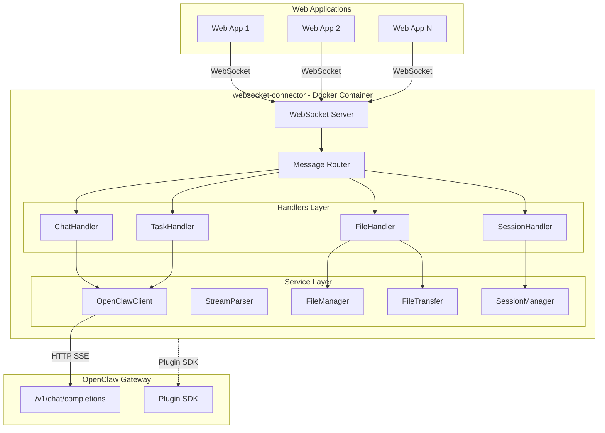
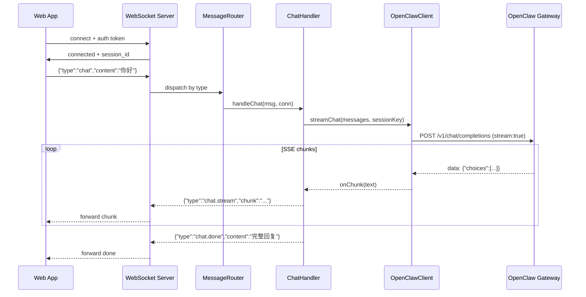
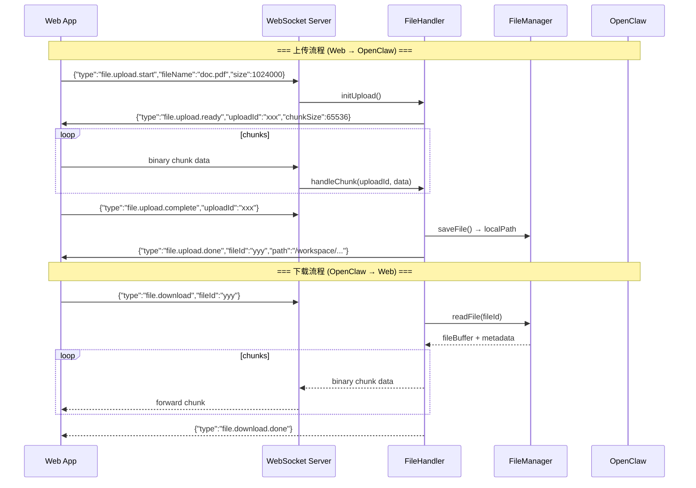
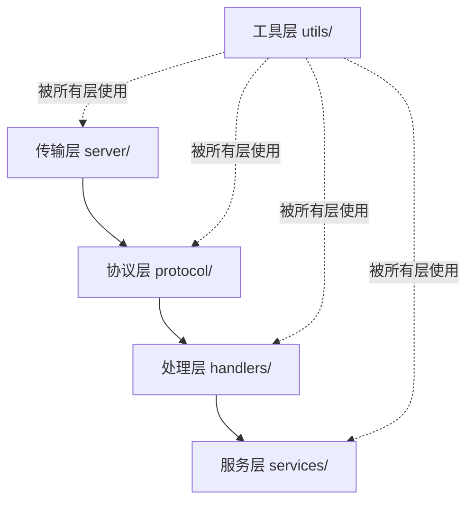

# OpenClaw 通用 WebSocket 插件 - 架构设计文档

## 一、核心定位

插件以 OpenClaw Plugin 形式运行在 OpenClaw Docker 容器内部，对外暴露一个 WebSocket 端口。任何 Web 项目只需连接该 WebSocket 地址，即可与 OpenClaw 通信，无需关心底层协议细节。

---

## 二、整体架构



---

## 三、数据流

### 3.1 对话流程（流式响应）



### 3.2 文件传输流程



---

## 四、目录结构

```
websocket-connector/
├── src/
│   ├── index.ts                    # 插件入口：注册到 OpenClaw，启动 WebSocket 服务
│   ├── config.ts                   # 配置管理：端口、路径、超时等
│   ├── types.ts                    # 全局类型定义
│   │
│   ├── server/                     # 【传输层】WebSocket 服务器
│   │   ├── WebSocketServer.ts      # WS 服务启停、连接监听、心跳检测
│   │   └── ConnectionManager.ts    # 连接池管理、认证、连接生命周期
│   │
│   ├── protocol/                   # 【协议层】消息协议定义与路由
│   │   ├── MessageTypes.ts         # 所有消息类型的枚举和接口定义
│   │   ├── MessageRouter.ts        # 按消息 type 字段分发到对应 Handler
│   │   └── Serializer.ts           # JSON 序列化/反序列化 + 二进制帧处理
│   │
│   ├── handlers/                   # 【处理层】业务逻辑处理器
│   │   ├── ChatHandler.ts          # 对话处理：普通/流式聊天
│   │   ├── FileHandler.ts          # 文件处理：上传/下载/转换请求
│   │   ├── TaskHandler.ts          # 任务处理：提交任务、查询状态、获取结果
│   │   └── SessionHandler.ts       # 会话处理：创建/恢复/销毁会话
│   │
│   ├── services/                   # 【服务层】核心业务服务
│   │   ├── gateway/
│   │   │   ├── OpenClawClient.ts   # OpenClaw Gateway HTTP 客户端（SSE 流式）
│   │   │   └── StreamParser.ts     # SSE 响应流解析器
│   │   ├── file/
│   │   │   ├── FileManager.ts      # 文件存储：保存、读取、清理过期文件
│   │   │   ├── FileTransfer.ts     # 分块传输：大文件分片上传/下载
│   │   │   └── FileConverter.ts    # 格式转换：PDF→DOC 等（调用 OpenClaw 能力）
│   │   └── session/
│   │       └── SessionManager.ts   # 会话生命周期：创建、超时清理、上下文维护
│   │
│   └── utils/                      # 【工具层】
│       ├── logger.ts               # 日志工具
│       └── errors.ts               # 统一错误码和错误类
│
├── openclaw.plugin.json            # OpenClaw 插件元数据
├── package.json                    # 依赖和脚本
├── tsconfig.json                   # TypeScript 配置
├── ARCHITECTURE.md                 # 本文档
└── README.md                       # 使用文档
```

---

## 五、分层设计原则

- **传输层** (`server/`)：WebSocket 连接管理、心跳、认证 → 向下调用协议层
- **协议层** (`protocol/`)：消息格式定义、路由分发、序列化 → 向下调用处理层
- **处理层** (`handlers/`)：业务逻辑编排，协调服务层完成任务 → 向下调用服务层
- **服务层** (`services/`)：具体能力实现（Gateway 通信、文件管理、会话管理）→ 不依赖上层
- **工具层** (`utils/`)：日志、错误处理等基础设施 → 被所有层使用

**关键原则：上层可以调用下层，下层不引用上层。Handler 是编排者，Service 是能力提供者。**



---

## 六、WebSocket 消息协议设计

所有消息均为 JSON 格式（文件二进制数据除外），统一结构：

```typescript
interface WSMessage {
  type: string;        // 消息类型，如 "chat", "file.upload.start"
  id: string;          // 消息唯一 ID（用于请求-响应匹配）
  payload: unknown;    // 业务数据
  timestamp: number;   // 时间戳
}
```

### 消息类型清单

**对话类：**
- `chat` — 发送对话消息
- `chat.stream` — 流式响应片段（服务端→客户端）
- `chat.done` — 对话完成（服务端→客户端）
- `chat.error` — 对话错误

**文件类：**
- `file.upload.start` — 发起上传（客户端→服务端）
- `file.upload.ready` — 上传就绪，返回 uploadId（服务端→客户端）
- `file.upload.complete` — 上传完成通知（客户端→服务端）
- `file.upload.done` — 上传处理完成（服务端→客户端）
- `file.download` — 请求下载（客户端→服务端）
- `file.download.done` — 下载完成（服务端→客户端）
- `file.convert` — 请求文件格式转换

**会话类：**
- `session.create` — 创建新会话
- `session.resume` — 恢复已有会话
- `session.destroy` — 销毁会话
- `session.list` — 列出当前连接的所有会话

**任务类：**
- `task.submit` — 提交异步任务
- `task.status` — 查询任务状态
- `task.result` — 获取任务结果
- `task.cancel` — 取消任务

**系统类：**
- `ping` / `pong` — 心跳
- `error` — 通用错误
- `auth` — 认证

---

## 七、核心模块设计要点

### 7.1 WebSocketServer（传输层）

- 基于 `ws` 库创建 WebSocket 服务
- 端口从 OpenClaw 配置或环境变量读取（默认 18800）
- 支持心跳检测（30s ping/pong），自动断开无响应连接
- 连接时通过 token 认证（`ConnectionManager` 负责）

### 7.2 MessageRouter（协议层）

- 注册式路由：各 Handler 启动时注册自己处理的 `type` 前缀
- 路由匹配规则：`chat.*` → ChatHandler，`file.*` → FileHandler
- 未知类型返回 `error` 消息

### 7.3 FileTransfer（服务层 - 文件传输）

- **分块策略**：默认 64KB/块，支持客户端协商块大小
- **上传流程**：start → 分块传输（binary frames）→ complete → 服务端组装
- **下载流程**：请求 → 服务端分块读取 → 逐块发送 → done
- **存储路径**：`~/.openclaw/workspace/media/` 下按 inbound/outbound 分目录
- **文件清理**：定时清理超过 24 小时的临时文件

### 7.4 OpenClawClient（服务层 - Gateway 通信）

- 封装对 OpenClaw Gateway 的 HTTP SSE 调用
- 抽象层设计：定义 `IGatewayClient` 接口，便于后续适配不同版本 API
- 支持流式和非流式两种模式
- 自动携带认证信息（从 PluginRuntime 获取 token）

### 7.5 SessionManager（服务层 - 会话管理）

- 每个 WebSocket 连接可绑定多个会话（通过 sessionId 区分）
- 会话超时：默认 30 分钟无活动自动清理
- 会话恢复：客户端断线重连时可通过 sessionId 恢复上下文

---

## 八、关键依赖

```json
{
  "dependencies": {
    "ws": "^8.x",
    "uuid": "^9.x",
    "clawdbot": "latest"
  },
  "devDependencies": {
    "typescript": "^5.x",
    "@types/ws": "^8.x",
    "@types/node": "^20.x"
  }
}
```

- `ws` — WebSocket 服务器
- `uuid` — 唯一 ID 生成（消息ID、会话ID、文件ID）
- `clawdbot` — OpenClaw Plugin SDK（参考项目同款）

文件转换能力（如 PDF→DOC）不在插件内实现，而是通过向 OpenClaw 发送任务指令，由 OpenClaw 的 Agent 能力完成转换后返回结果文件路径。

---

## 九、Web 客户端接入示例

```typescript
// 任意 Web 项目只需以下代码即可接入
const ws = new WebSocket('ws://your-openclaw-host:18800');

// 1. 认证
ws.onopen = () => {
  ws.send(JSON.stringify({
    type: 'auth',
    id: '1',
    payload: { token: 'your-token' },
    timestamp: Date.now()
  }));
};

// 2. 发送对话
ws.send(JSON.stringify({
  type: 'chat',
  id: '2',
  payload: { sessionId: 'abc', content: '帮我把这个PDF转成Word' },
  timestamp: Date.now()
}));

// 3. 接收响应
ws.onmessage = (event) => {
  const msg = JSON.parse(event.data);
  switch (msg.type) {
    case 'chat.stream':
      process.stdout.write(msg.payload.chunk);
      break;
    case 'chat.done':
      console.log('\n完成:', msg.payload.content);
      break;
    case 'error':
      console.error('错误:', msg.payload.message);
      break;
  }
};
```

---

## 十、实施步骤

1. **初始化项目**：创建目录、package.json、tsconfig.json、openclaw.plugin.json
2. **类型与配置**：编写 types.ts 全局类型定义 + config.ts 配置管理
3. **工具层**：编写 utils/logger.ts 和 utils/errors.ts
4. **协议层**：编写 MessageTypes.ts + Serializer.ts + MessageRouter.ts
5. **传输层**：编写 WebSocketServer.ts + ConnectionManager.ts
6. **服务层 - Gateway**：编写 OpenClawClient.ts + StreamParser.ts
7. **服务层 - 文件**：编写 FileManager.ts + FileTransfer.ts + FileConverter.ts
8. **服务层 - 会话**：编写 SessionManager.ts
9. **处理层**：编写 ChatHandler / FileHandler / TaskHandler / SessionHandler
10. **插件入口**：编写 index.ts 整合所有模块
11. **文档**：编写 README.md 使用文档
